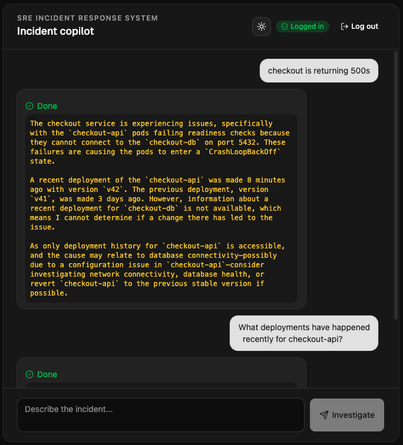

<div align="center">

# SRE Incident Response System

*An on-call agent that investigates and responds to incidents, crossing identity domains when the action does.*


[](LICENSE)

</div>

An on-call agent investigates and responds to an incident by gathering the information it needs and taking the appropriate remediation steps. When an action crosses into another team’s environment, the agent obtains a separately scoped identity trusted by that environment, making the hand-off explicit and controlled rather than simply forwarding existing credentials.

The engineer signs in once with Entra. Routine investigation, such as checking pod health and deployment history, stays within the engineer’s existing identity domain and happens transparently through Keycloak, which is federated with Entra.

When the agent needs to take an action in another team’s environment, such as rolling back a deployment, it crosses into a separate trust domain that relies directly on Entra rather than Keycloak. The first time this happens, the engineer is asked to explicitly consent before the agent can continue.



Take a look at [images/sequence-diagram.png](images/sequence-diagram.png) for a high level flow.

## Layout

```
.
├── agent
├── chat-app
│   ├── public
│   ├── server
│   └── src
├── images
└── mcp-servers
    ├── incident-mcp
    └── runbook-mcp
    ├── repo-mcp
```

## Running locally

Each Go component is independent (`go.work` workspace, not a single module) - build/run/test them individually:

```bash
cd mcp-servers/incident-mcp && go run .
cd agent && go run .
cd chat-app && npm install && npm run dev
```

The three MCP servers are also built as container images and deployed behind a real Enterprise Agentgateway instance (see the design doc for that deployment) - running them locally is only for iterating on the Go code itself.

See each component's own comments for required environment variables.
